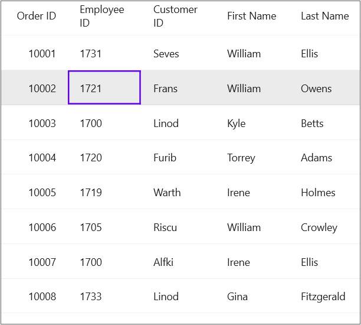

# how-to-pass-selected-row-s-data-to-a-command-in-maui-datagrid
In.NET [MAUI DataGrid](https://www.syncfusion.com/maui-controls/maui-datagrid) (SfDataGrid) provides two events for selection [SelectionChanging](https://help.syncfusion.com/cr/maui/Syncfusion.Maui.DataGrid.SfDataGrid.html#Syncfusion_Maui_DataGrid_SfDataGrid_SelectionChanging) and [SelectionChanged](https://help.syncfusion.com/cr/maui/Syncfusion.Maui.DataGrid.SfDataGrid.html#Syncfusion_Maui_DataGrid_SfDataGrid_SelectionChanged). It provides the added items and the removed items as arguments in it. You can pass the selected row info to a command in the ViewModel.

Refer the below code example in which a custom behavior for passing the selected row information to ViewModel is defined.

## XAML
```XML
<syncfusion:SfDataGrid x:Name="dataGrid"
                     SelectionMode="Single"
                     ItemsSource="{Binding OrderInfo}">
        <syncfusion:SfDataGrid.Behaviors>
            <local:CustomBehavior Command="{Binding SelectionCommand}"
                            Converter="{StaticResource gridSelectionChangedEventArgs}" />
        </syncfusion:SfDataGrid.Behaviors>
        <syncfusion:SfDataGrid.Columns>
            <syncfusion:DataGridNumericColumn MappingName="OrderID" HeaderText="Order ID" Format="d"/>
            <syncfusion:DataGridTextColumn MappingName="EmployeeID" HeaderText="Employee ID"/>
            <syncfusion:DataGridTextColumn MappingName="CustomerID" HeaderText="Customer ID"/>
            <syncfusion:DataGridTextColumn MappingName="FirstName" HeaderText="First Name"/>
            <syncfusion:DataGridTextColumn MappingName="LastName" HeaderText="Last Name"/>
        </syncfusion:SfDataGrid.Columns>
    </syncfusion:SfDataGrid>
```
## C#
```C#
// ViewModel
public class ViewModel
{
    private ICommand selectionCommand;
    public ICommand SelectionCommand
    {
        get { return selectionCommand; }
        set { selectionCommand = value; }
    }
    public ViewModel()
    {
        selectionCommand = new Command<DataGridSelectionChangedEventArgs>(OnSelectionChanged);
        OrderInfoRepository orderInfoRepository = new OrderInfoRepository();
        orderInfo = orderInfoRepository.GetOrderDetails(30);
    }
    private ObservableCollection<OrderInfo> orderInfo;

    public ObservableCollection<OrderInfo> OrderInfo
    {
        get { return orderInfo; }
        set { this.orderInfo = value; }
    }
    internal void GenerateItemsSource(int count)
    {
        OrderInfoRepository order = new OrderInfoRepository();
        orderInfo = order.GetOrderDetails(count);
    }
    private void OnSelectionChanged(DataGridSelectionChangedEventArgs e)
    {
        var SelectedItem = e.AddedRows;            
    }
} 
```
## Custom Behavior
```C#
// Behavior
public class CustomBehavior : Behavior<SfDataGrid>
{
    public static readonly BindableProperty CommandProperty = BindableProperty.Create("Command", typeof(ICommand), typeof(CustomBehavior), null);
    public static readonly BindableProperty InputConverterProperty = BindableProperty.Create("Converter", typeof(IValueConverter), typeof(CustomBehavior), null);

    public ICommand Command
    {
        get { return (ICommand)GetValue(CommandProperty); }
        set { SetValue(CommandProperty, value); }
    }

    public IValueConverter Converter
    {
        get { return (IValueConverter)GetValue(InputConverterProperty); }
        set { SetValue(InputConverterProperty, value); }
    }

    public SfDataGrid AssociatedObject { get; private set; }

    protected override void OnAttachedTo(SfDataGrid bindable)
    {
        base.OnAttachedTo(bindable);
        AssociatedObject = bindable;
        bindable.BindingContextChanged += OnBindingContextChanged;
        bindable.SelectionChanged += Bindable_SelectionChanged;
    }

    private void Bindable_SelectionChanged(object sender, DataGridSelectionChangedEventArgs e)
    {
        if (Command == null)
            return;

        object gridSelectionChangedEventArgs = Converter.Convert(e, typeof(object), null, null);
        if (Command.CanExecute(gridSelectionChangedEventArgs))
            Command.Execute(gridSelectionChangedEventArgs);
    }

    protected override void OnDetachingFrom(SfDataGrid bindable)
    {
        base.OnDetachingFrom(bindable);
        bindable.BindingContextChanged -= OnBindingContextChanged;
        bindable.SelectionChanged -= Bindable_SelectionChanged;
        AssociatedObject = null;
    }

    private void OnBindingContextChanged(object sender, EventArgs e)
    {
        OnBindingContextChanged();
    }

    protected override void OnBindingContextChanged()
    {
        base.OnBindingContextChanged();
        BindingContext = AssociatedObject.BindingContext;
    }
}

public class CustomConverter : IValueConverter
{
    public object Convert(object value, Type targetType, object parameter, CultureInfo culture)
    {
        return value;
    }

    public object ConvertBack(object value, Type targetType, object parameter, CultureInfo culture)
    {
        throw new NotImplementedException();
    }
} 
```

## Conclusion
I hope you enjoyed learning about how to pass the row's data to a command  in MAUI DataGrid (SfDataGrid).

You can refer to our [.NET MAUI DataGrid’s feature tour](https://www.syncfusion.com/maui-controls/maui-datagrid) page to know about its other groundbreaking feature representations. You can also explore our .NET MAUI DataGrid Documentation to understand how to present and manipulate data.
For current customers, you can check out our .NET MAUI components from the [License and Downloads](https://www.syncfusion.com/account/downloads) page. If you are new to Syncfusion, you can try our 30-day free trial to check out our .NET MAUI DataGrid and other .NET MAUI components.
If you have any queries or require clarifications, please let us know in comments below. You can also contact us through our [support forums](https://www.syncfusion.com/forums), [Direct-Trac](https://support.syncfusion.com/account/login?ReturnUrl=%2Faccount%2Fconnect%2Fauthorize%2Fcallback%3Fclient_id%3Dc54e52f3eb3cde0c3f20474f1bc179ed%26redirect_uri%3Dhttps%253A%252F%252Fsupport.syncfusion.com%252Fagent%252Flogincallback%26response_type%3Dcode%26scope%3Dopenid%2520profile%2520agent.api%2520integration.api%2520offline_access%2520kb.api%26state%3D8db41f98953a4d9ba40407b150ad4cf2%26code_challenge%3DvwHoT64z2h21eP_A9g7JWtr3vp3iPrvSjfh5hN5C7IE%26code_challenge_method%3DS256%26response_mode%3Dquery) or [feedback portal](https://www.syncfusion.com/feedback/maui?control=sfdatagrid). We are always happy to assist you!

